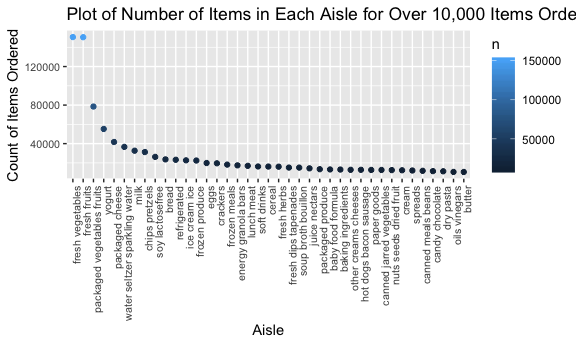

p8105\_hw3\_jl5295
================
Jana Lee
10/7/2019

## Problem 1: Instacart

Load the data for Instacart and Exploration of Aisles

``` r
data("instacart")

number_aisles = 
  instacart %>% 
  count(aisle) %>% 
  arrange(desc(n)) %>% 
  view()
```

**Description of Dataset:** In the `instacart` dataset, there are
1,384,617 observations and 15 variables. There are 15 columns in the
dataset. Some key variables in this dataset include `product_name`,
`order_hour_of_day`, and `add_to_cart_order`.

**How many aisles are there, and which aisles are the most items ordered
from?** There are 134 unique aisles. The tope 3 aisles most ordered from
are, from most ordered to least: “fresh vegetables” (150,609 orders),
“fresh fruits” (150,473 orders), and “packaged vegetables
fruits”(78,493 orders).

Aisle Plot

``` r
aisle_plot = 
  filter(number_aisles, n > 10000)

ggplot(aisle_plot, aes(
    x = reorder(aisle, -n), 
    y = n)) +
  geom_point(aes(color = n)) +
  theme (axis.text.x = element_text(angle = 90, hjust = 1),
         axis.text = element_text(size=8)) +
  labs (
    title = "Plot of Number of Items in Each Aisle for Over 10,000 Items Ordered ",
    x = "Aisle",
    y = "Count of Items Ordered")
```


**Please note that plot is ordered by most number of orders in each
aisle to least to least number of orders in each aisle.**

Table Showing 3 Most Popular Items

``` r
table_pop_items = instacart %>% 
  filter(
    aisle == "baking ingredients" | 
    aisle == "dog food care" | 
    aisle == "packaged vegetables fruits") %>% 
  group_by(aisle, product_name) %>% 
  summarize (n = n()) %>% 
  mutate (top_three = min_rank(desc(n))) %>% 
  filter (top_three <= 3)
  
table_pop_items %>% 
  knitr::kable()
```

| aisle                      | product\_name                                 |    n | top\_three |
| :------------------------- | :-------------------------------------------- | ---: | ---------: |
| baking ingredients         | Cane Sugar                                    |  336 |          3 |
| baking ingredients         | Light Brown Sugar                             |  499 |          1 |
| baking ingredients         | Pure Baking Soda                              |  387 |          2 |
| dog food care              | Organix Chicken & Brown Rice Recipe           |   28 |          2 |
| dog food care              | Small Dog Biscuits                            |   26 |          3 |
| dog food care              | Snack Sticks Chicken & Rice Recipe Dog Treats |   30 |          1 |
| packaged vegetables fruits | Organic Baby Spinach                          | 9784 |          1 |
| packaged vegetables fruits | Organic Blueberries                           | 4966 |          3 |
| packaged vegetables fruits | Organic Raspberries                           | 5546 |          2 |

Table Showing Pink Lady Apples and Coffee Ice Cream Orders

``` r
table_apples_coffee = instacart %>% 
  filter(
    product_name == "Pink Lady Apples" | 
    product_name == "Coffee Ice Cream") %>% 
  group_by(product_name, order_dow) %>% 
  summarize(
    mean_order = round(mean(order_hour_of_day), digits = 0)) %>% 
  pivot_wider(
   names_from = "order_dow" , 
   values_from = "mean_order")  %>% 
  rename(
    "Sunday" = "0", 
    "Monday" = "1", 
    "Tuesday" = "2", 
    "Wednesday" = "3", 
    "Thursday" = "4", 
    "Friday" = "5", 
    "Saturday" = "6") %>% 
  rename ("Product Name" = product_name)

table_apples_coffee %>% 
  knitr::kable()
```

| Product Name     | Sunday | Monday | Tuesday | Wednesday | Thursday | Friday | Saturday |
| :--------------- | -----: | -----: | ------: | --------: | -------: | -----: | -------: |
| Coffee Ice Cream |     14 |     14 |      15 |        15 |       15 |     12 |       14 |
| Pink Lady Apples |     13 |     11 |      12 |        14 |       12 |     13 |       12 |

## Problem 2: BRFSS

Loading & Data Cleaning:

``` r
data("brfss_smart2010")

brfss = brfss_smart2010 %>% 
  janitor::clean_names() %>%
  filter(
    topic == "Overall Health" |
    response == "Poor" | 
    response == "Fair" |
    response == "Very Good" |
    response == "Excellent") %>%
  select(-location_id, -data_value_footnote_symbol, -data_value_footnote) %>% 
  mutate(response = ordered(response, c("Poor", "Fair", "Good", "Very good", "Excellent"))) 

brfss
```

    ## # A tibble: 10,625 x 20
    ##     year locationabbr locationdesc class topic question response
    ##    <int> <chr>        <chr>        <chr> <chr> <chr>    <ord>   
    ##  1  2010 AL           AL - Jeffer… Heal… Over… How is … Excelle…
    ##  2  2010 AL           AL - Jeffer… Heal… Over… How is … Very go…
    ##  3  2010 AL           AL - Jeffer… Heal… Over… How is … Good    
    ##  4  2010 AL           AL - Jeffer… Heal… Over… How is … Fair    
    ##  5  2010 AL           AL - Jeffer… Heal… Over… How is … Poor    
    ##  6  2010 AL           AL - Mobile… Heal… Over… How is … Excelle…
    ##  7  2010 AL           AL - Mobile… Heal… Over… How is … Very go…
    ##  8  2010 AL           AL - Mobile… Heal… Over… How is … Good    
    ##  9  2010 AL           AL - Mobile… Heal… Over… How is … Fair    
    ## 10  2010 AL           AL - Mobile… Heal… Over… How is … Poor    
    ## # … with 10,615 more rows, and 13 more variables: sample_size <int>,
    ## #   data_value <dbl>, confidence_limit_low <dbl>,
    ## #   confidence_limit_high <dbl>, display_order <int>,
    ## #   data_value_unit <chr>, data_value_type <chr>, data_source <chr>,
    ## #   class_id <chr>, topic_id <chr>, question_id <chr>, respid <chr>,
    ## #   geo_location <chr>

In 2002, which states were observed at 7 or more locations? What about
in 2010?

``` r
states_2002 = brfss %>% 
  filter (year == "2002") %>% 
  group_by(locationabbr) %>% 
  summarize(
    number_obs = n_distinct(geo_location)) %>% 
  filter(number_obs >= 7) %>% 
  rename("states" = locationabbr)

states_2010 = brfss %>% 
  filter (year == "2010") %>% 
  group_by(locationabbr) %>% 
  summarize(
    number_obs = n_distinct(geo_location)) %>% 
  filter(number_obs >= 7) %>% 
  rename("states" = locationabbr)
```

In 2002, six states were observed at 7 or more locations: CT, FL, MA,
NC, NJ, and PA. In 2010, fourteen states were observed at 7 or more
locations: CA, CO, FL, MA, MD, NC, NE, NJ, NY, OH, PA, SC,TX, WA.

Make Excellent Dataset:

``` r
excellent_data = brfss %>% 
  filter(response == "Excellent") %>% 
  group_by(year, locationabbr) %>% 
  summarize(mean_value = round(mean(data_value, na.rm = TRUE), digits = 2)) %>% 
  rename("state" = locationabbr)
```

Spaghetti Plot:

``` r
spaghetti_plot = excellent_data %>% 
  ggplot(aes(x = year, y = mean_value, color = state)) +
  geom_line() +
  labs(
    title = "Spaghetti Plot of Average Value Over Time in 50 States",
    x = "Year",
    y = "Average Data Values"
  )

spaghetti_plot
```


## Problem 3: Accelerometers

Loading, tidying, and wrangling the data

``` r
accel_data = read_csv("./data/accel_data.csv") %>% 
  janitor::clean_names() %>% 
  mutate(
    weekday = recode(day, "Saturday" = 0, "Sunday" = 0, "Monday" = 1, "Tuesday" = 1, "Wednesday" = 1, "Thursday" = 1, "Friday" = 1),
    weekend = recode(day, "Saturday" = 1, "Sunday" = 1, "Monday" = 0, "Tuesday" = 0, "Wednesday" = 0, "Thursday" = 0, "Friday" = 0), 
    day = ordered(day, c("Saturday", "Sunday", "Monday", "Tuesday", "Wednesday", "Thursday", "Friday")),
    week = ordered(week, c("1", "2", "3", "4", "5"))) %>% 
  select(week, day_id, day, weekend, weekday, everything()) %>% 
  pivot_longer(
    cols = starts_with("activity_"),
    names_to = "activity_number",
    names_prefix = "activity_",
    values_to = "activity_counts") %>% 
  mutate(activity_number = as.numeric(activity_number))
```

    ## Parsed with column specification:
    ## cols(
    ##   .default = col_double(),
    ##   day = col_character()
    ## )

    ## See spec(...) for full column specifications.

``` r
accel_data
```

    ## # A tibble: 50,400 x 7
    ##    week  day_id day    weekend weekday activity_number activity_counts
    ##    <ord>  <dbl> <ord>    <dbl>   <dbl>           <dbl>           <dbl>
    ##  1 1          1 Friday       0       1               1            88.4
    ##  2 1          1 Friday       0       1               2            82.2
    ##  3 1          1 Friday       0       1               3            64.4
    ##  4 1          1 Friday       0       1               4            70.0
    ##  5 1          1 Friday       0       1               5            75.0
    ##  6 1          1 Friday       0       1               6            66.3
    ##  7 1          1 Friday       0       1               7            53.8
    ##  8 1          1 Friday       0       1               8            47.8
    ##  9 1          1 Friday       0       1               9            55.5
    ## 10 1          1 Friday       0       1              10            43.0
    ## # … with 50,390 more rows

The resulting `accel_data` dataset has 50400 observations and 7
variables. The resulting dataset specifies weekday and weekend variables
and has collapsed the activity counts in a more readable format.

Create a Total Activity Variable for each day & Create a Table showing
Activity Totals

``` r
total_activity = accel_data %>% 
  group_by(week,day_id, day) %>% 
  summarize (total_min = sum(activity_counts))

total_activity %>% 
  knitr::kable()
```

| week    |   day\_id | day           |                                                                                                                                                                                                                                                                                                                                                                                                                                                           total\_min |
| :------ | --------: | :------------ | -------------------------------------------------------------------------------------------------------------------------------------------------------------------------------------------------------------------------------------------------------------------------------------------------------------------------------------------------------------------------------------------------------------------------------------------------------------------: |
| 1       |         1 | Friday        |                                                                                                                                                                                                                                                                                                                                                                                                                                                            480542.62 |
| 1       |         2 | Monday        |                                                                                                                                                                                                                                                                                                                                                                                                                                                             78828.07 |
| 1       |         3 | Saturday      |                                                                                                                                                                                                                                                                                                                                                                                                                                                            376254.00 |
| 1       |         4 | Sunday        |                                                                                                                                                                                                                                                                                                                                                                                                                                                            631105.00 |
| 1       |         5 | Thursday      |                                                                                                                                                                                                                                                                                                                                                                                                                                                            355923.64 |
| 1       |         6 | Tuesday       |                                                                                                                                                                                                                                                                                                                                                                                                                                                            307094.24 |
| 1       |         7 | Wednesday     |                                                                                                                                                                                                                                                                                                                                                                                                                                                            340115.01 |
| 2       |         8 | Friday        |                                                                                                                                                                                                                                                                                                                                                                                                                                                            568839.00 |
| 2       |         9 | Monday        |                                                                                                                                                                                                                                                                                                                                                                                                                                                            295431.00 |
| 2       |        10 | Saturday      |                                                                                                                                                                                                                                                                                                                                                                                                                                                            607175.00 |
| 2       |        11 | Sunday        |                                                                                                                                                                                                                                                                                                                                                                                                                                                            422018.00 |
| 2       |        12 | Thursday      |                                                                                                                                                                                                                                                                                                                                                                                                                                                            474048.00 |
| 2       |        13 | Tuesday       |                                                                                                                                                                                                                                                                                                                                                                                                                                                            423245.00 |
| 2       |        14 | Wednesday     |                                                                                                                                                                                                                                                                                                                                                                                                                                                            440962.00 |
| 3       |        15 | Friday        |                                                                                                                                                                                                                                                                                                                                                                                                                                                            467420.00 |
| 3       |        16 | Monday        |                                                                                                                                                                                                                                                                                                                                                                                                                                                            685910.00 |
| 3       |        17 | Saturday      |                                                                                                                                                                                                                                                                                                                                                                                                                                                            382928.00 |
| 3       |        18 | Sunday        |                                                                                                                                                                                                                                                                                                                                                                                                                                                            467052.00 |
| 3       |        19 | Thursday      |                                                                                                                                                                                                                                                                                                                                                                                                                                                            371230.00 |
| 3       |        20 | Tuesday       |                                                                                                                                                                                                                                                                                                                                                                                                                                                            381507.00 |
| 3       |        21 | Wednesday     |                                                                                                                                                                                                                                                                                                                                                                                                                                                            468869.00 |
| 4       |        22 | Friday        |                                                                                                                                                                                                                                                                                                                                                                                                                                                            154049.00 |
| 4       |        23 | Monday        |                                                                                                                                                                                                                                                                                                                                                                                                                                                            409450.00 |
| 4       |        24 | Saturday      |                                                                                                                                                                                                                                                                                                                                                                                                                                                              1440.00 |
| 4       |        25 | Sunday        |                                                                                                                                                                                                                                                                                                                                                                                                                                                            260617.00 |
| 4       |        26 | Thursday      |                                                                                                                                                                                                                                                                                                                                                                                                                                                            340291.00 |
| 4       |        27 | Tuesday       |                                                                                                                                                                                                                                                                                                                                                                                                                                                            319568.00 |
| 4       |        28 | Wednesday     |                                                                                                                                                                                                                                                                                                                                                                                                                                                            434460.00 |
| 5       |        29 | Friday        |                                                                                                                                                                                                                                                                                                                                                                                                                                                            620860.00 |
| 5       |        30 | Monday        |                                                                                                                                                                                                                                                                                                                                                                                                                                                            389080.00 |
| 5       |        31 | Saturday      |                                                                                                                                                                                                                                                                                                                                                                                                                                                              1440.00 |
| 5       |        32 | Sunday        |                                                                                                                                                                                                                                                                                                                                                                                                                                                            138421.00 |
| 5       |        33 | Thursday      |                                                                                                                                                                                                                                                                                                                                                                                                                                                            549658.00 |
| 5       |        34 | Tuesday       |                                                                                                                                                                                                                                                                                                                                                                                                                                                            367824.00 |
| 5       |        35 | Wednesday     |                                                                                                                                                                                                                                                                                                                                                                                                                                                            445366.00 |
| Looking | at the \` | accel\_data\` | dataset, there are no obvious patterns that are present. Some days have more activity than others, but the pattern is not clear. Taking a closer look week by week, we find that in Week 1, Monday had the lowest activity in minutes. In Week 2, Monday had the lowest activity in minutes. In Week 3, Thursday had the lowest activity in minutes. In Week 4, Saturday had the lowest activity in minutes. In Week 5, Saturday had the lowest activity in minutes. |

Acceleration Plot Over 5-Week Period

``` r
accel_plot = accel_data %>% 
  group_by(week, day_id, day) %>% 
  summarize (average_min = mean(activity_counts)) %>% 
  ggplot(aes(x = day_id, y = average_min, color = day)) +
  geom_line() +
  labs(
    title = "24-hour activity of Male Accelerometer Data Over 5-Week Period",
    x = "Day in 5-Week Period",
    y = "Average Activity in Minutes "
  )

accel_plot
```


Similar to what we noticed in the previous problem, we can see here that
Monday’s activity count was very low, but increased over the 5-week
period. Contrastingly, Saturday and Sunday’s activity counts started
high, but decreased over the 5-week period.
